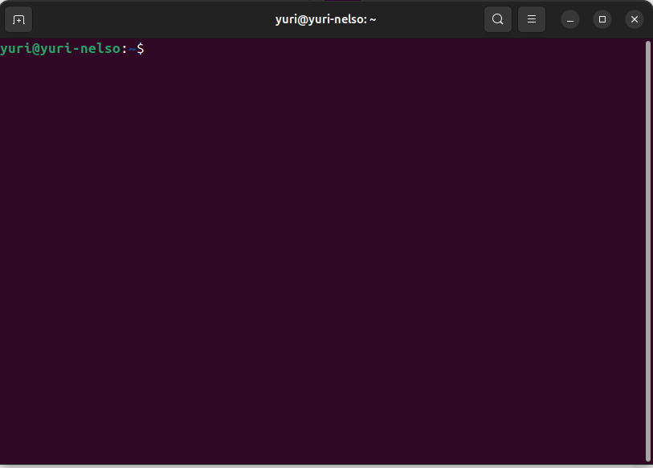
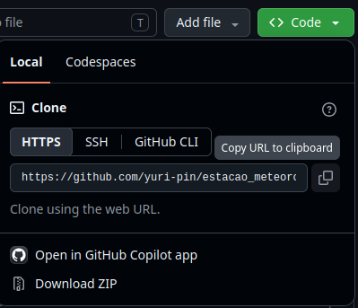

Seja bem vindo à inicialização ao GitHub, aqui serão apresentados os primeiros passos, para que possa ser possível disponibilizar publicamente um código que foi feito na sua Iniciação Científica / Mestrado / Doutorado / Publicações.

Para podermos darmos esses primeiros passos, será necessário que já tenha ao menos a conta criada, para isso, entre no site do [GitHub](https://github.com/?locale=pt-br). E clicar para crair conta, que pedirá um emial de referência, como o e-mail institucional não existirá para sempre caso saia um dia da universidade, recomendamos que crie com e-mail pessoal, ou caso queira mudar acesse o seguinte link ("aqui disponibilizar como mudar o email de entrada no GitHub Setting -> email -> add email -> mudar esse novo email para principal")

Criada a conta podemos seguir. E para que possamos adicionar nosso projeto ao GitHub, teremos que criar um repositório para cada projeto que estamos envolvidos. Depois aprender como colocar esses arquivos nesses reposítórios, por fim, como baixar ou atualizar seu repositório local

## Como criar um repositório
Entre em sua conta , onde no canto superior esquerdi da tela aparecerá a seguinte extrutura:

Esse item que está marcado, será na figura acima, voceê terá uma visualização de todo o ser perfil e toda a sua atividade, mas vamos deixar essa descrição apra depois. Como queremos criar um repositório, clique no segundo item escrito Repositories(Repositórios).

Nessa aba, podemos ter a visão geral de todos os repositórios que criamos, sendo que na parte superior dessa página, teremos a seguinte estrutura:

Com isso, para criarmos um novo repositório clicamos no botão verde, escrito New (Novo) onde abrirá uma página com as configurações gerais do repositório que queremos criar. 

1. **Primeiro precisamos criar um nome**: onde esse nome tem que ser relativamente simples, mas antes de simples tem que ser fácil de lembrar para ser facilmente pesquisados pelos seus pares.
2. **Escrever uma descrição**: Essa parte não é tão importante, para a criação em si do repositório, então podemos pular essa parte por enquanto.
3. **Escolher a visibilidade do projeto**: Temos para essa parte duas opções, Public(pública) e Private (privado).
  
    1. **Public**: Todas as pessoas que estão no GitHub poderão acessar esses códigos/arquivos.

    2. **Private**: Somente você poderá acessar esse repositório. 

4. **Adicionar um README**: deixar essa opção como "on". Essa opção permite que você crie um texto introdutório para o que será lido, de forma a deixar mais ditático.

5. **Adicionar uma licença**: Essa licença permitirá que seus direitos autorais sejam protegidos, geralmente a licença MIT funciona bem, mas em caso de dúvidas só pesquisar no google qual licença se encaixa melhor, com suas necessidades.

## Acessar e alterar o repositório
Teremos nessa parte duas possibilidades que trabalharemos separadamente, caso só tenhamos o repositório vazio e não tivermos uma pasta em contrapartida no nosso computador;  o outro caso é caso já tenhamos um repositório local e queremos subir ele para nosso repositório recem criado.

### Primeiro caso
Dentro desse primeiro caso, temos um problema mais simples pois temos que fazer somente uma clonagem do nosso repositório recem-criado, para nossa máquina. Para isso teremos que entrar no terminal(Linux: **Ctrl+Alt+T** / Windows: **Win+R** depois **Enter**). E abrirá a seguinte página:

No terminal iremos para a pasta que queremos clonar, geralmente, inicialmente pode ser feita na área de trabalho do computados. Para isso, ao entrar no terminal digite:

    cd Área\ de\ trabalho/
    
E para sair dessa pasta basta digitar:

    cd ..

Estando na pasta que desejamos, podemos clonar o repositório do GitHub que desejamos, para isso digite

    git clone [url do repositório desejado]

**Dica**: para copiar e colar dentro do terminal, pelo menos para sistemas Linux podemos usar o atalho (**Ctrl+shift+C** para copiar e **Ctrl+shift+V** para colar).

Apertando **Enter** teremos, iniciará a clonagem do repositório.

Finalizada a clonagem, parabéns se divirta fazendo os códigos dentro dessa pasta, se possível da forma mais organizada possível.

### Segundo caso
Já para o segundo caso, temos uma leve diferença, pelo fato de não fazermos a clonagem do repositório com `git clone`, pela prévia existência de uma pasta com arquivos. Podemos fazer um `git clone` e copiar e colar os documentos que tinhamos na outra pasta. Mas, nessa seção fazermos outro caminho possível.

Para isso, pelo terminal, entre na pasta em que se deseja fazer o commit dos arquivos desejados. E digite:

    git init
    git remote add origin [URL do repositório]

Um dúvida que pode surgir é, onde eu encontro essa `URL`? E ela pode ser obtida entrando no seu repositório e clicando no botão verde escrito Code<>, como mostrado na seguinte figura:

Com isso ele gerará algumas possibilidades, para esse início clique em `HTML`, como mostrado na seguinte figura:

Feito isso podemos seguir o processo de fazer os commit que virá a seguir. 

## Como fazer o primeiro commit

Feitas as primeiras alterações com as conecções com o GitHub já estabelecidas, podemos agora fazer nosso primeiro commit (que possui a ideia de atualizar o repositórios conforme for trabalhando nos seus projetos). Para isso, entre no terminal como descrito acima, dentro da pasta que foi clonada ou que já existia e você criou uma conexão entre seu computador e o repositório.

Já dentro da pasta **correta**, pois caso faça na pasta errada dará erros, fique atento a essa parte.

Digite no terminal 

    git add .

Esse espaço entre o _add_ e o ponto final é necessário. Agora, digite:

    git commit -m "essa é uma mensagem para o commit"

Essa mensagem ficará ao lado de cada arquivo dentro de seu repositório. Ela serve para dar um indicativo do que cada parte faz. Por fim, digite:

    git push origin main

Essa estrutura evita erros, pois ela dá uma indicação de caminho para esse _push_ que estamos fazendo.

## Como fazer a primeira sincronização

Uma das maiores vantagens do uso do GitHub é que podemos fazer alterações de diversos computadores. Caso o código que esteja trabalahando teve algumas modificações por você em outros computadores. Mas por algum motivo um dos seus repositório está desatualizado se comparado com o repositório original.

Para que atualizar o código podemos digitar no terminal:

    git pull origin main