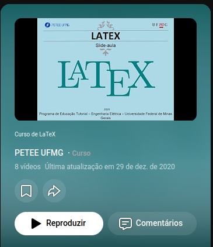
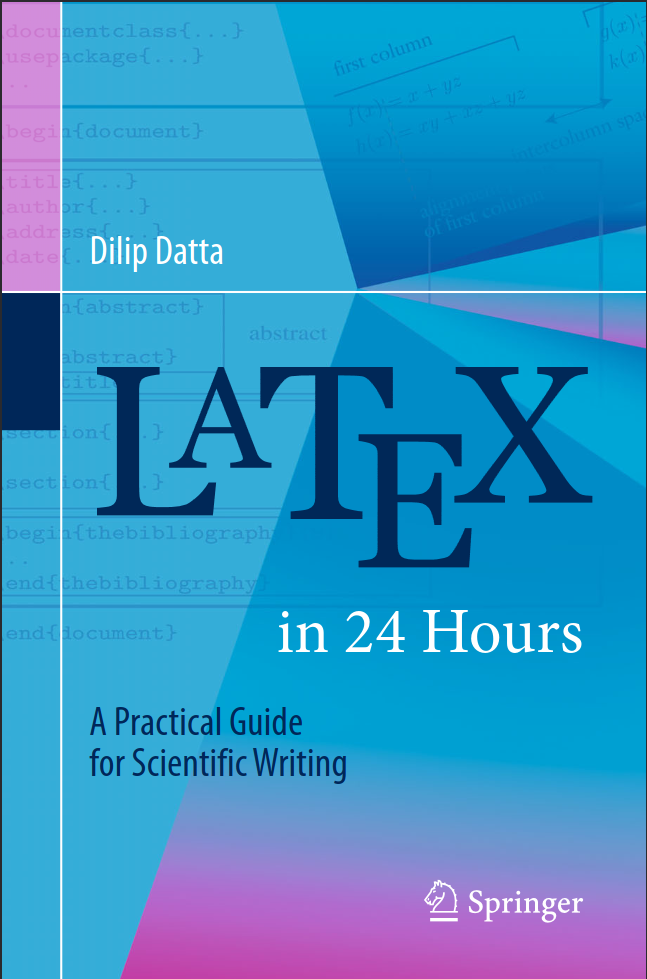

# Primeiros passos no LaTex

Pelo fato de termos diversas carreiras se torna mais complicado indicar o uso de bilbiotecas ou pacotes para um uso específico. Assim, de forma abrnagente buscaremos mostrar alguns materiais em português e inglês para a introdução de comandos básicos.

## Documentos em Português

Temos uma apostila feita pelo Professor Reinaldo J. Santos da UFMG que escreveu de forma bem sintética os principais aspectos do uso de Latex. Pode ser encontrado no seguinte link: [_Introdução ao Latex_](https://docs.ufpr.br/~aanjos/latex/latex/intlat.pdf).

Outra possibilidade é o curso gravado pelo Programa de Educação Tutorial da Engenharia Elétrica Universidade Federal de Minas Gerais (PETEE-UFMG), que descreve também de forma breve os principais aspectos da escrita em Latex. Disponível no seguinte link: [_LaTeX_](https://www.youtube.com/playlist?list=PL73kW0L8uzCJg-6sPga5JLWgtbcoBrn9q).

## Documentos em Inglês 

Temos também materiais em inglês que são muito mais completos que os apresentados acima, fazendo a necessidade de pesquisar em outras fontes muito menor. E todo aluno USP tem acesso a esse material no seguinte link: [_LaTeX in 24 hours_](https://link.springer.com/book/10.1007/978-3-319-47831-9)

